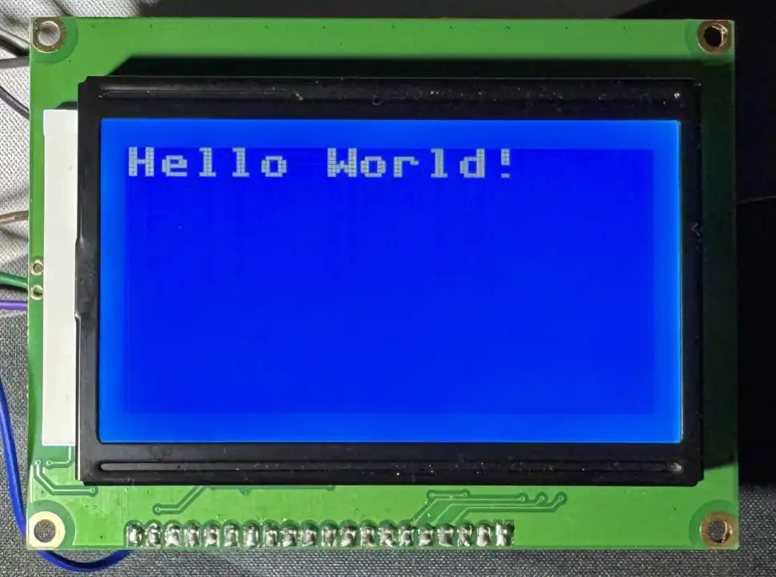

# MicroPython ST7920
A MicroPython driver for the ST7920 128x64 LCD Display.

## Features
- Communicate over SPI
- Supports MicroPython FrameBuffers
- Can automatically handle partial updates

## Design Notes
When using this library there are a few important things to know:

- Uses `micropython.viper` decorator for performance. If your platform does not support this, you will need to modify the driver code.
- Partial updates requires having two FrameBuffers in-memory
- Partial updates are only per row
- Timing on these displays are sensitive, try a lower baudrate if screen gets corrupted e.g. `1_000_000`

## Works On
- Raspberry Pi Pico

## License
 Licensed under the [MIT License](http://opensource.org/licenses/MIT), found in `LICENSE.txt`.
